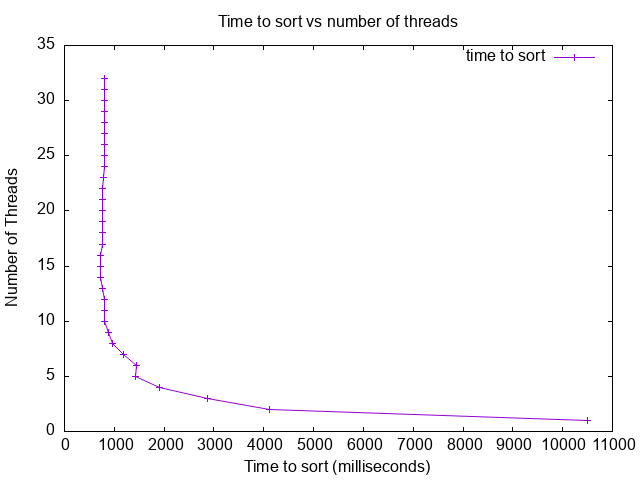

### System Configuration
- M3 pro
- 36 GB RAM

## Analysis

The graph above illustrates how the time taken to sort an array is affected by the number of threads in a multi-threaded merge sort. Initially, increasing the number of threads significantly reduces the sorting time because it allows more concurrent processing of sorting tasks, which speeds up the overall process. However, as the thread count continues to rise, the graph shows a slowdown, especially after around 9 threads. This slowdown is due to the overhead involved in managing many threads, including context switching. When there are too many threads, the system spends more time coordinating and managing them rather than performing the actual sorting work. This effect is especially noticeable if the number of threads exceeds the available CPU cores. In my case, the optimal performance was observed with around 9 threads, which aligns with the number of physical cores on my machine. Beyond this point, adding more threads led to a slight increase in sorting time.

## The optimum number of threads is 9.

The fastest sorting time occurred with 9 threads, demonstrating that the best performance is achieved when the number of threads matches or slightly exceeds the number of CPU cores. In contrast, the slowest sorting times were seen with 1 thread (single-threaded execution) and with 30 or more threads. Single-threaded execution is slower because it does not take advantage of parallelism, while excessive threading introduces substantial management overhead.

In summary, my results match the expected pattern seen in the example graph. The implementation achieved a clear reduction in sorting time as the number of threads increased, up to a point, beyond which the overhead led to diminishing returns. This experiment emphasizes the importance of adjusting the thread count to match system capabilities for optimal performance. It also illustrates the trade-off between parallel processing benefits and the overhead of managing threads, a critical factor in multi-threaded programming.